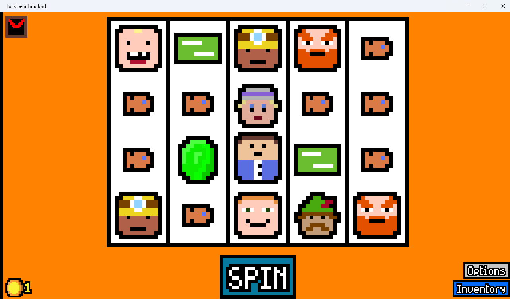

# "Social Security" mod for Luck Be A Landlord

## New symbols

- *Relief Check* -> A relief payment from the government. Gives 1 gold per turn, plus 2 gold per adjacent Human.
- *Conservative* -> Destroys relief checks, and gives 3 gold to wealthy people and things. Eats candy. Drinks booze. Can be destroyed by Robin Hood.

## New items (effects)

- *Mining Union* -> Dwarves and Miners Unite! 2 gold for every active dwarf and miner.

## TODO

- *Daycare* -> toddlers will be moved to daycare, and fed apples.

## Author notes

- [Modding Wiki](https://github.com/TrampolineTales/LBAL-Modding-Docs/wiki/)
- [Game](https://trampolinetales.itch.io/luck-be-a-landlord)
- Game Developer: [Dan Dilorio](https://trampolinetales.com/)
- Mod Developer: [Michael Adams](https://unquietwiki.com)
